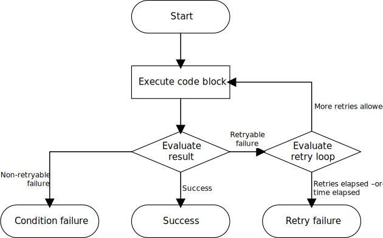

# Retry Design

* **Type**: Design
* **Author(s)**: Ian Botsford

# Abstract

Retryers are an abstraction designed to run a block of code one or more times until a specific condition is met. For
instance, a user may wish to call an SDK API and automatically retry transient failures until either a definitive
success or a non-transient error occurs. Requiring callers to implement retries themselves may incur boilerplate,
errors, and suboptimal timing.

This document covers the generalized mechanism of retries and a general implementation for retrying service calls which
exhibit transient failures. It lays out interfaces/primitives for specification and a canonical AWS SDK implementation.

Although retry primitives are intended to be reusable by waiters, this document does not go into detail about waiters
themselves.

# Definitions

This document uses definitions from [RFC 2119](https://datatracker.ietf.org/doc/html/rfc2119) for terms like **MUST**
and **MAY**.

# Generalized retry flow

In general, retries happen in a loop with two evaluation conditions and three exit conditions:



The block of code *is always executed at least once* and its result is evaluated:

* If the result represents a success condition, the workflow exits and yields the successful result.
* If the result represents a non-retryable failure condition, the workflow exits and throws an exception.
* If the result represents a retryable failure, then the retry loop itself is evaluated:
    * If too many retries have occurred or too much time has elapsed, the workflow exits and throws an exception.
    * Otherwise, the code block is rerun and reevaluated.

# Specification

Retries are specified by the following types:

## Retry strategy

```kotlin
interface RetryStrategy {
    suspend fun <R> retry(policy: RetryPolicy<R>, block: suspend () -> R): R
}
```

A `RetryStrategy` accepts a `RetryPolicy` and a block of code. It executes the block of code *at least one time*,
evaluates the result with a `RetryPolicy`, and then succeeds (returning the result), fails (throwing an API exception),
or retries the call. Details of how many tries to attempt, whether/how to delay between tries, etc., are implementation-
specific.

## Retry policies

```kotlin
interface RetryPolicy<in R> {
    fun evaluate(result: Result<R>): RetryDirective
}

sealed class RetryDirective {
    object TerminateAndSucceed : RetryDirective()
    object TerminateAndFail : RetryDirective()
    data class RetryError(val reason: RetryErrorType) : RetryDirective()
}

enum class RetryErrorType {
    ServerSide,
    ClientSide,
    Throttling,
    Timeout,
    ;
}
```

A `RetryPolicy` evaluates an API call result to indicate how a `RetryStrategy` should proceed. The passed result is a
[`kotlin.Result`](https://kotlinlang.org/api/latest/jvm/stdlib/kotlin/-result/) containing either a typed API response
or a thrown exception.

The returned value from an evaluation is a `RetryDirective`. This directive instructs the `RetryStrategy` to either:

* **Terminate and succeed**. A strategy **SHOULD** react to this directive by returning the result's value to the
  caller.
* **Terminate and fail**. A strategy **SHOULD** react to this directive by throwing the result's exception.
* **Retry based on a specific error type**. A strategy **SHOULD** react to this directive by rerunning the block and
  re-evaluating the result.

The `RetryErrorType` indicates the class of error detected by an evaluation. A strategy **MAY** react to different
error types in different ways (e.g., varying delay patterns for certain types).

# Standard implementation

This section discusses the canonical implementation of the standard **smithy-kotlin** retry strategy. The standard retry
mechanism uses an algorithm backed by:
* **Token bucket**. The bucket is decremented before retries (but not before the first try). Successful tries return
  capacity to the bucket. Different error types are decremented at different amounts (e.g., throttling errors are more
  "expensive", get decremented at a higher rate, and thus get tried at a slower rate). The token bucket refills over
  time regardless of success/failure.
* **Exponential backoff**. An exponential backoff is applied before retries (but not before the first try). This backoff
  occurs before attempting to get capacity from the token bucket. The backoff uses jitter to randomize the retry
  interval, lessening the likelihood of retry storms.

## Retry strategy

The standard SDK retry strategy is implemented by `StandardRetryStrategy`:

```kotlin
class StandardRetryStrategy(
    val options: StandardRetryStrategyOptions,
    private val tokenBucket: RetryTokenBucket,
    private val backoffDelayer: BackoffDelayer,
) : RetryStrategy {

    override suspend fun <R> retry(policy: RetryPolicy<R>, block: suspend () -> R): R =
        withTimeout(options.maxTimeMs) {
            doTryLoop(block, policy, 1, tokenBucket.acquireToken(), null)
        }

    private tailrec suspend fun <R> doTryLoop(
        block: suspend () -> R,
        policy: RetryPolicy<R>,
        attempt: Int,
        fromToken: RetryToken,
        previousResult: Result<R>?,
    ): R {
        val callResult = runCatching { block() }
        if (callResult.exceptionOrNull() is TimeoutCancellationException) {
            throwTimeOut(fromToken, attempt, previousResult)
        }

        val nextToken = try {
            when (val evaluation = policy.evaluate(callResult)) {
                is RetryDirective.TerminateAndSucceed ->
                    return success(fromToken, callResult)

                is RetryDirective.TerminateAndFail ->
                    throwFailure(fromToken, attempt, callResult)

                is RetryDirective.RetryError ->
                    if (attempt >= options.maxAttempts) {
                        throwTooManyAttempts(fromToken, attempt, callResult)
                    } else {
                        // Prep for another loop
                        backoffDelayer.backoff(attempt)
                        fromToken.scheduleRetry(evaluation.reason)
                    }
            }
        } catch (e: TimeoutCancellationException) {
            throwTimeOut(fromToken, attempt, callResult)
        }

        return doTryLoop(block, policy, attempt + 1, nextToken, callResult)
    }

    private suspend fun <R> success(token: RetryToken, result: Result<R>): R {
        token.notifySuccess()
        return result.getOrNull()!!
    }

    // Omitting throwFailure, throwTimeOut, and throwTooManyAttempts for brevity
}
```

The retry strategy takes as input an `StandardRetryOptions` with configuration parameters, a `RetryTokenBucket` that
handles the bucket implementation and delays, and `BackoffDelayer` that handles backoff delays.

## Retry token bucket

The strategy's token bucket is provided via an interface:

```kotlin
interface RetryTokenBucket {
    suspend fun acquireToken(): RetryToken
}

interface RetryToken: Closeable {
    suspend fun notifyFailure()
    suspend fun notifySuccess()
    suspend fun scheduleRetry(reason: RetryErrorType): RetryToken
}
```

Strategies utilizing this token bucket interface **MUST** call `acquireToken` before the initial try of a block. After
that try is evaluated, the strategy **MUST** either:

* call `notifyFailure` when the try was successful and no more tries are needed
* call `notifySuccess` when the try was successful and no more tries are needed
* call `scheduleRetry` and pass the error type when the try was unsuccessful and more tries are needed

After calling one of the above methods the token is effectively "resolved" and callers **MUST NOT** call any of the
above methods again.

The specific implementation utilized by the **smithy-kotlin** is not given here.

## Backoff delayer

The strategy's backoff implementation is provided via an interface:

```kotlin
interface BackoffDelayer {
    suspend fun backoff(attempt: Int)
}
```

Strageies utilizing this delayer interface **SHOULD** call `backoff` before retries, passing the number of the attempt.
That number is used to calculate the delay amount. The method returns after delaying as appropriate.

The specific implementation utilized by the **smithy-kotlin** is not given here.

## Retry policy

A universal `RetryPolicy` should be possible for most use cases:

```kotlin
open class StandardRetryPolicy : RetryPolicy<Any?> {
  override fun evaluate(result: Result<Any?>): RetryDirective = when {
    result.isSuccess -> RetryDirective.TerminateAndSucceed
    else -> evaluate(result.exceptionOrNull()!!)
  }

  private fun evaluate(ex: Throwable): RetryDirective =
    (ex as? SdkBaseException)?.run(::evaluateBaseException)
      ?: (ex as? ServiceException)?.run(::evaluateServiceException)
      ?: (ex as? ClientException)?.run { RetryDirective.RetryError(RetryErrorType.ClientSide) }
      ?: evaluateNonSdkException(ex)
      ?: evaluateOtherExceptions(ex)
      ?: RetryDirective.TerminateAndFail

  private fun evaluateBaseException(ex: SdkBaseException): RetryDirective? = with(ex.sdkErrorMetadata) {
    when {
      isThrottling -> RetryDirective.RetryError(RetryErrorType.Throttling)
      else -> null
    }
  }

  private fun evaluateServiceException(ex: ServiceException): RetryDirective? = with(ex.sdkErrorMetadata) {
    when {
      isRetryable && errorType == ErrorType.Server -> RetryDirective.RetryError(RetryErrorType.ServerSide)
      isRetryable && errorType == ErrorType.Client -> RetryDirective.RetryError(RetryErrorType.ClientSide)
      else -> null
    }
  }

  protected open fun evaluateOtherExceptions(ex: Throwable): RetryDirective? = null

  private fun evaluateNonSdkException(ex: Throwable): RetryDirective? =
    // TODO Write logic to find connection errors, timeouts, stream faults, etc.
    null
}
```

This policy succeeds on any non-exception `Result`. For exceptions, it follows a multi-tiered strategy to find the best
applicable outcome, falling through from case to case by way of nulls:

* If the exception is an `SdkBaseException` see if the metadata indicates a throttling exception
* If the exception is a `ServiceException` see if the metadata indicates a retryable exception at the server or client
* See if the exception is a `ClientException`
* If the exception is a generic `Throwable` attempt to map to an error type such as timeout, cilent-side, etc. The
  example code does not show this and its implementation is TBD.
* Call `evaluateOtherExceptions` to allow subclasses to provide custom logic for result evaluation.
* If none of the above succeed, terminate and fail (indicating that the RetryStrategy **SHOULD** throw the exception)

This class is marked `open` and consumers **MAY** provide customizations via `evaluateOtherExceptions` for their
specific use cases (e.g., new types of exceptions not available in **smithy-kotlin**).

# Revision history

* 9/27/2021 - Created
