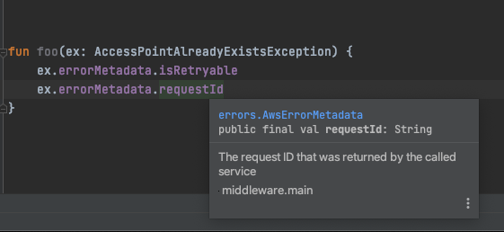

# SDK Exception Hierarchy and Metadata Representation
* **Type**: Design
* **Author(s)**: Aaron Todd

# Abstract

Generated exceptions have to deal with two sets of information:

1. The modeled exception data, these are fields found in the Smithy model and specific to the error
2. Un-modeled metadata, these are things that customers and or the SDK runtime care about but not found in the model and populated by the runtime. Examples include `requestId`, whether an error is retryable, the operation executed, etc.

This document weighs different designs for implementing Smithy modeled errors as Kotlin exceptions with respect to model conflicts and dealing with metadata.

The original/current design for generating exceptions is here: [Kotlin Modeled Errors Design](modeled-errors.md)

# Design

## Motivation

The motivation for modifying the current design stems from:


### 1. A desire to reduce the chance of conflicts between modeled and un-modeled fields

The way exceptions are generated currently has a high chance of conflict between the modeled types and the un-modeled types.


As an example the current base class for all AWS service exceptions is defined as:


```kotlin
/**
 * Base class for all modeled service exceptions
 */
public open class AwsServiceException : ServiceException {

    ...

    /**
     * The request ID that was returned by the called service
     */
    public open var requestId: String = ""

    /**
     * Returns the error code associated with the response
     */
    public open var errorCode: String = ""
}

```


These two fields `requestId` and `errorCode` both result in conflicts in a handful of models (and subsequently fails to compile) because the errors themselves have fields with matching names.


See: https://github.com/awslabs/smithy-kotlin/issues/110

As you can see this inherits from another type `ServiceException` which defines several other (un-modeled) fields further increasing the chance of a conflict. This also means that future modifications to the hierarchy could be difficult due to possible conflicts.

The exception hierarchy is defined [here](https://github.com/awslabs/smithy-kotlin/blob/v0.1.0-M0/client-runtime/client-rt-core/common/src/software/aws/clientrt/Exceptions.kt) and further extended [here](https://github.com/awslabs/aws-sdk-kotlin/blob/v0.1.0-M0/client-runtime/aws-client-rt/common/src/aws/sdk/kotlin/runtime/Exceptions.kt).


### 2. A desire to remove mutability

The un-modeled fields are typically not known until runtime when a request or response is known. The original design chose to model these fields as mutable (`var`) properties such that they could be set when know. The overall SDK favors immutability whenever possible though and it's worth looking to see if we can do better here since the fields are generally only ever set once anyway and thus probably should be immutable from the customer's perspective.


### 3. A desire to be open to extension

We don't know what the future holds or in what ways we may need to extend the hierarchy to e.g. special case a service or add new metadata. The ability to easily add new metadata in a backwards compatible way is a desirable property. Examples that come to mind are service specific extensions like S3 which has [two possible request id fields](https://aws.amazon.com/premiumsupport/knowledge-center/s3-request-id-values/)


## Solutions

Several solutions are presented below that try to balance dealing with possible conflicts as well as the ability to add new metadata easily.


### ALT 1: Rename customization

One option is to simply do nothing to the exception hierarchy and resolve conflicts manually or automatically by changing the generated fields to not conflict.
The names of the fields in the hierarchy are known and we could detect conflicts at generation time.

This is an easy solution but probably not the most customer obsessed one. Errors with conflicts will end up with fields that don't match the name found in the service documentation.

Take `AccessPointsAlreadyExist` from the EFS model which looks like the following:


```
@httpError(409)
@error("client")

structure AccessPointAlreadyExists {
    ErrorCode: String
    ErrorMessage: String
    AccessPointId: String
}
```


The `ErrorCode` field will have a conflict with the `errorCode` field from the `AwsServiceException` base class (structure properties are lower cased in Kotlin).

This solution would require renaming `AccessPointAlreadyExists.ErrorCode` to something like `AccessPointAlreadyExists.ErrorCodeValue` to avoid the conflict.

### ALT 2: Builder Hierarchy

Another option is to use the builder pattern to create exceptions. A full example is given below (spoiler this isn’t optimal either and it’s a lot of code so before diving in maybe skip to the end of section for summary):

```kotlin
/**
 * Base exception class for all exceptions thrown by the SDK. Exception may be a client side exception or a service exception
 */
open class SdkBaseException : RuntimeException {

    constructor() : super()

    constructor(message: String?) : super(message)

    constructor(message: String?, cause: Throwable?) : super(message, cause)

    constructor(cause: Throwable?) : super(cause)

    protected constructor(builder: Builder): super(builder.message, builder.cause)

    open val isRetryable: Boolean = false

    interface Builder {
        var message: String?
        var cause: Throwable?
    }

    protected open class BuilderImpl : Builder {
        final override var message: String? = null
        final override var cause: Throwable? = null

        constructor() : super()

        protected constructor(ex: SdkBaseException): this() {
            message = ex.message
            cause = ex.cause
        }
    }

    open fun toBuilder(): Builder = BuilderImpl().also {
        it.message = message
        it.cause = cause
    }

}

/**
 * Base exception class for any errors that occur while attempting to use an SDK client to make (Smithy) service calls.
 */
open class ClientException : SdkBaseException {
    constructor() : super()

    constructor(message: String?) : super(message)

    constructor(message: String?, cause: Throwable?) : super(message, cause)

    constructor(cause: Throwable?) : super(cause)


    protected constructor(builder: Builder): super(builder)

    interface Builder : SdkBaseException.Builder

    protected open class BuilderImpl : Builder, SdkBaseException.BuilderImpl {
        constructor() : super()
        constructor(ex: ClientException): super(ex)
    }

    override fun toBuilder(): Builder = BuilderImpl(this)
}

/**
 * Generic interface that any protocol (e.g. HTTP, MQTT, etc) can extend to provide additional access to
 * protocol specific details.
 */
interface ProtocolResponse

private object EmptyProtocolResponse : ProtocolResponse

/**
 * ServiceException - Base exception class for any error response returned by a service. Receiving an exception of this
 * type indicates that the caller's request was successfully transmitted to the service and the service sent back an
 * error response.
 */
open class ServiceException : SdkBaseException {

    /**
     * Indicates who (if known) is at fault for this exception.
     */
    enum class ErrorType {
        Client,
        Server,
        Unknown
    }

    constructor() : this(null, null)

    constructor(message: String?) : this(message, null)
    constructor(cause: Throwable?) : this(null, cause)

    constructor(message: String?, cause: Throwable?) : super(message, cause) {
        serviceName = ""
        protocolResponse = EmptyProtocolResponse
    }

    protected constructor(builder: Builder) : super(builder.message, builder.cause) {
        serviceName = builder.serviceName
        protocolResponse = builder.protocolResponse
    }


    /**
     * Indicates who is responsible for this exception (caller, service, or unknown)
     */
    open val errorType: ErrorType = ErrorType.Unknown

    /**
     * The name of the service that sent this error response
     */
    val serviceName: String

    /**
     * The protocol response if available (this will differ depending on the underlying protocol e.g. HTTP, MQTT, etc)
     */
    val protocolResponse: ProtocolResponse


    interface Builder : SdkBaseException.Builder {
        var serviceName: String
        var protocolResponse: ProtocolResponse
    }

    protected open class BuilderImpl : Builder, SdkBaseException.BuilderImpl {
        constructor(): super()

        constructor(ex: ServiceException): super(ex) {
            serviceName = ex.serviceName
            protocolResponse = ex.protocolResponse
        }

        final override var serviceName: String = ""
        final override var protocolResponse: ProtocolResponse = EmptyProtocolResponse

        open fun build(): ServiceException = ServiceException(this)
    }

    override fun toBuilder(): Builder = BuilderImpl(this)
}

/**
 * Base class for all modeled service exceptions
 */
public open class AwsServiceException : ServiceException {

    public constructor() : this(null, null)

    public constructor(message: String?) : this(message, null)

    public constructor(message: String?, cause: Throwable?) : super(message, cause) {
        requestId = ""
        errorCode = ""

    }

    protected constructor(builder: Builder) : super(builder.message, builder.cause) {
        requestId = builder.requestId
        errorCode = builder.errorCode
    }

    /**
     * The request ID that was returned by the called service
     */
    val requestId: String

    /**
     * Returns the error code associated with the response
     */
    val errorCode: String

    interface Builder : ServiceException.Builder {
        var requestId: String
        var errorCode: String
    }

    protected open class BuilderImpl : Builder, ServiceException.BuilderImpl {
        constructor(): super()

        constructor(ex: AwsServiceException): super(ex) {
            requestId = ex.requestId
            errorCode = ex.errorCode
        }

        final override var requestId: String = ""
        final override var errorCode: String = ""

        override fun build(): AwsServiceException = AwsServiceException(this)
    }

    override fun toBuilder(): Builder = BuilderImpl(this)
}
```


An example of a generated exception that inherits from this hierarchy:

```kotlin

/**
 * Returned if the access point you are trying to create already exists
 */
class AccessPointAlreadyExistsException private constructor(builder: BuilderImpl) : AwsServiceException(builder) {

    val errorCode: String? = builder.errorCode  // conflicts with parent errorCode
    val errorMessage: String? = builder.errorMessage
    val accessPointId: String? = builder.accessPointId

    interface DslBuilder {
        var errorCode: String?
        var errorMessage: String?
        var accessPointId: String?

        fun build(): AccessPointAlreadyExistsException
    }

    private class BuilderImpl : DslBuilder, AwsServiceException.BuilderImpl {
       ` ``override var errorCode: String? = ""  // conflicts with parent errorCode`
        override var errorMessage: String? = ""
        override var accessPointId: String? = ""

        constructor(): super()
        constructor(ex: AccessPointAlreadyExistsException) : super(ex) {
            this.errorCode = ex.errorCode
            this.errorMessage = ex.errorMessage
            this.accessPointId = ex.accessPointId
        }

        override fun build(): AccessPointAlreadyExistsException = AccessPointAlreadyExistsException(this)
    }

    override val errorType = ErrorType.Client
}
```


**Advantages:**

* This gets around the mutability problem by using the same builder technique employed by all the structure types we generate. This allows going to/from a builder and setting un-modeled fields as needed

As a simplified example, the following middleware component could populate `requestId` on all AWS service exceptions thrown (not likely how we would implement it but it demonstrates our point):

```kotlin
suspend fun myMiddleware(request, next) {
    try {
       return next.call(request)
   catch(ex: AwsServiceException) {
       val requestId = getRequestId(request.context)
       throw ex.toBuilder().also { it.requestId = requestId }.build()
   }
}
```

**Disadvantages:**

* This still doesn’t actually solve the conflict issue. The Java V2 SDK employs a similar pattern to this but they hide many of the fields in a new type `[AwsErrorDetails](https://sdk.amazonaws.com/java/api/latest/software/amazon/awssdk/services/efs/model/AccessPointAlreadyExistsException.Builder.html)` which is why they have no conflict (in this case). This doesn’t solve the issue though as the Java V2 SDK still has conflicts in other cases. Take `[IdentityStore.AccessDeniedException](https://sdk.amazonaws.com/java/api/latest/software/amazon/awssdk/services/identitystore/model/AccessDeniedException.Builder.html)` which has a modeled field of `requestId` which conflicts with `AwsServiceException.requestId`. They de-conflict by renaming the modeled exception field to `requestIdValue`.

### ALT 3: PropertyBag + Extensions

Another option is to lift all the un-modeled (and even a few of the modeled) fields into a single extendable type (a property bag).

```kotlin
/**
 * Additional metadata about an error
 */
open class ErrorMetadata {
    @InternalApi
    val attributes: Attributes = Attributes()       // PropertyBag

    companion object {
        /**
         * Set if an error is retryable
         */
        val Retryable: AttributeKey<Boolean> = AttributeKey("Retryable")
    }

    val isRetryable: Boolean
        get() = attributes.getOrNull(Retryable) ?: false
}

/**
 * Base exception class for all exceptions thrown by the SDK. Exception may be a client side exception or a service exception
 */
open class SdkBaseException : RuntimeException {

    constructor() : super()

    constructor(message: String?) : super(message)

    constructor(message: String?, cause: Throwable?) : super(message, cause)

    constructor(cause: Throwable?) : super(cause)

    open val errorMetadata: ErrorMetadata = ErrorMetadata()
}

/**
 * Base exception class for any errors that occur while attempting to use an SDK client to make (Smithy) service calls.
 */
open class ClientException : SdkBaseException {
    constructor() : super()

    constructor(message: String?) : super(message)

    constructor(message: String?, cause: Throwable?) : super(message, cause)

    constructor(cause: Throwable?) : super(cause)
}

/**
 * Generic interface that any protocol (e.g. HTTP, MQTT, etc) can extend to provide additional access to
 * protocol specific details.
 */
interface ProtocolResponse

object EmptyProtocolResponse : ProtocolResponse

open class ServiceErrorMetadata : ErrorMetadata() {

    companion object {
        val ProtocolResponse: AttributeKey<ProtocolResponse> = AttributeKey("ProtocolResponse")

        val ErrorType: AttributeKey<ServiceException.ErrorType> = AttributeKey("ErrorType")

        val ServiceName: AttributeKey<String> = AttributeKey("ServiceName")
    }

    /**
     * The name of the service that sent this error response
     */
    val serviceName: String
        get() = attributes.getOrNull(ServiceName) ?: ""

    /**
     * Indicates who is responsible for this exception (caller, service, or unknown)
     */
    val errorType: ServiceException.ErrorType
        get() = attributes.getOrNull(ErrorType) ?: ServiceException.ErrorType.Unknown


    /**
     * The protocol response if available (this will differ depending on the underlying protocol e.g. HTTP, MQTT, etc)
     */
    val protocolResponse: ProtocolResponse
        get() = attributes.getOrNull(ProtocolResponse) ?: EmptyProtocolResponse

}

/**
 * ServiceException - Base exception class for any error response returned by a service. Receiving an exception of this
 * type indicates that the caller's request was successfully transmitted to the service and the service sent back an
 * error response.
 */
open class ServiceException : SdkBaseException {

    /**
     * Indicates who (if known) is at fault for this exception.
     */
    enum class ErrorType {
        Client,
        Server,
        Unknown
    }

    constructor() : super()

    constructor(message: String?) : super(message)

    constructor(message: String?, cause: Throwable?) : super(message, cause)

    constructor(cause: Throwable?) : super(cause)

    override val errorMetadata: ServiceErrorMetadata = ServiceErrorMetadata()
}


open class AwsErrorMetadata : ServiceErrorMetadata() {
    companion object {
        val RequestId: AttributeKey<String> = AttributeKey("RequestId")
        val ErrorCode: AttributeKey<String> = AttributeKey("ErrorCode")
    }

    /**
     * The request ID that was returned by the called service
     */
    val requestId: String
        get() = attributes.getOrNull(RequestId) ?: ""

    /**
     * Returns the error code associated with the response
     */
    val errorCode: String
        get() = attributes.getOrNull(ErrorCode) ?: ""

}

/**
 * Base class for all modeled service exceptions
 */
public open class AwsServiceException : ServiceException {

    public constructor() : super()

    public constructor(message: String?) : super(message)

    public constructor(message: String?, cause: Throwable?) : super(message, cause)

    override val errorMetadata: AwsErrorMetadata = AwsErrorMetadata()
}

```


Example of an exception inheriting from this hierarchy (slightly simplified):

```kotlin
/**
 * Returned if the access point you are trying to create already exists
 */
class AccessPointAlreadyExistsException private constructor(builder: BuilderImpl) : AwsServiceException() {

    val errorCode: String? = builder.errorCode
    val errorMessage: String? = builder.errorMessage
    val accessPointId: String? = builder.accessPointId

    init {
        errorMetadata.attributes[ErrorMetadata.Retryable] = false
        errorMetadata.attributes[ServiceErrorMetadata.ErrorType] = ErrorType.Client
    }

    interface DslBuilder {
        var errorCode: String?
        var errorMessage: String?
        var accessPointId: String?

        fun build(): AccessPointAlreadyExistsException
    }

    private class BuilderImpl : DslBuilder {
        override var errorCode: String? = ""
        override var errorMessage: String? = ""
        override var accessPointId: String? = ""

        constructor(): super()
        constructor(ex: AccessPointAlreadyExistsException) : super() {
            this.errorCode = ex.errorCode
            this.errorMessage = ex.errorMessage
            this.accessPointId = ex.accessPointId
        }

        override fun build(): AccessPointAlreadyExistsException = AccessPointAlreadyExistsException(this)
    }
}
```

**Example usage:**



**Example extensions:**


```kotlin

class S3ErrorMetadata : AwsErrorMetadata() {
    companion object {
        val ExtendedRequestId: AttributeKey<String> = AttributeKey("S3:ExtendedRequestId")
    }

    val extendedRequestId: String
        get() = attributes.getOrNull(ExtendedRequestId) ?: ""
}

/**
 * Base class for all S3 errors
 */
class S3Exception : AwsServiceException {
    public constructor() : super()

    public constructor(message: String?) : super(message)

    public constructor(message: String?, cause: Throwable?) : super(message, cause)

    override val errorMetadata: S3ErrorMetadata = S3ErrorMetadata()
}

// ALTERNATIVELY defined as an extension property


val AwsErrorMetadata.extendedRequestId: String
    get() = attributes.getOrNull(S3ErrorAttributes.ExtendedRequestId) ?: ""
```


**Advantages**:

* Gives the appearance of immutability while still allowing the fields to be set at runtime
* Easily extendable. The metadata type can be customized and generated per service and extension properties can be defined on it as needed.
* Significantly reduces the chance of conflicts since there is only one field, `errorMetadata` , to worry about (does not completely remove the chance of a conflict though).

**Disadvantages**:

* Discoverability. Common properties can be defined in the base class (e.g. `AwsErrorMetadata.requestId`) but any extension properties past this may be slightly more difficult to discover. This could probably be mitigated somewhat by some careful choices around the package/subpackage that extensions are defined in such that it’s at least always consistent.

## Other Considerations

* Some SDK’s expose fields like `requestId` on more than just the error types. If the Kotlin SDK chooses to do something similar we should reconcile and ensure that there is “one way” to get at a piece of data.

## Recommendation

The recommendation/consensus is to move forward with ALT 3 which provides the best opportunity for future extension, removes the customer facing mutability, and reduces the chance of conflict to a single property.

### Additional References

* [Modeled Errors](modeled-errors.md)
* [Kotlin Smithy SDK](kotlin-smithy-sdk.md)
* [Smithy Core Spec](https://awslabs.github.io/smithy/1.0/spec/core/shapes.html)


# Revision history

* 6/09/2021 - Initial upload
* 4/02/2020 - Created


