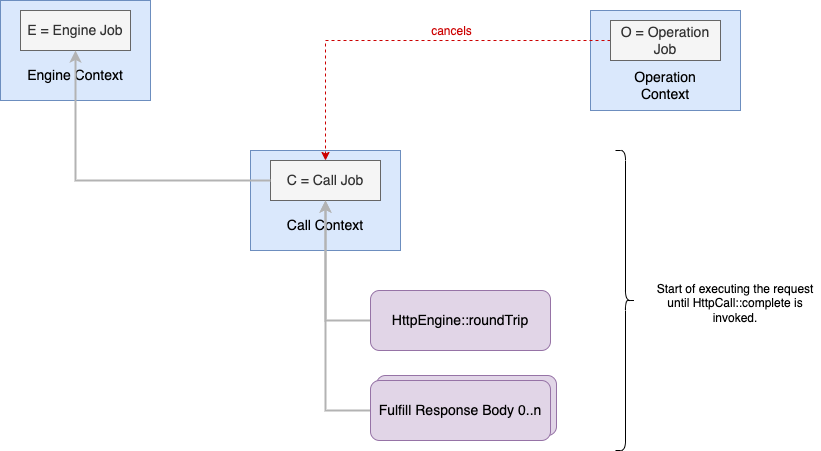

# Structured Concurrency

This document gives an overview of the [CoroutineScope](https://kotlinlang.org/api/kotlinx.coroutines/kotlinx-coroutines-core/kotlinx.coroutines/-coroutine-scope/)(s) 
used by the SDK. It is meant to be a living document and provide additional context and guidance for SDK authors.

## Definitions

* **Coroutine** - An instance of a suspendable computation. A coroutine itself is represented by a Job. It is responsible for coroutine’s lifecycle, cancellation, and parent-child relations.
* **CoroutineContext** - Persistent (immutable) context for a coroutine
* **CoroutineScope** - Defines a scope for new coroutines which delimits the lifetime of the coroutine
* **Structured Concurrency** - A principle expected by coroutines (in Kotlin) whereby new coroutines can only be launched into a specific CoroutineScope. This constraint ensures that coroutines are not leaked and that errors are propagated correctly. An outer scope cannot complete until all its child coroutines complete. 
* **HttpCall** - A single HTTP request/response pair. 
* **HttpClientEngine** - A component responsible for executing an HTTP request and returning an HttpCall
* **ExecutionContext** - Operation scoped (mutable) context used to drive an operation to completion

## Scopes

The SDK has three implementations of `CoroutineScope`:

1. [ExecutionContext](https://github.com/awslabs/smithy-kotlin/blob/main/runtime/runtime-core/common/src/aws/smithy/kotlin/runtime/operation/ExecutionContext.kt#L16)
2. [HttpClientEngine](https://github.com/awslabs/smithy-kotlin/blob/main/runtime/protocol/http-client/common/src/aws/smithy/kotlin/runtime/http/engine/HttpClientEngine.kt#L20)
3. [HttpCall](https://github.com/awslabs/smithy-kotlin/blob/main/runtime/protocol/http/common/src/aws/smithy/kotlin/runtime/http/response/HttpCall.kt#L28)
    

`ExecutionContext` implements `CoroutineScope` to provide a place for any background work to be done as part of implementing an operation. 
Its scope begins and ends with an operation. The only place it is utilized is to launch background task(s) to process input event streams 
(pull data from the customer input event stream, transform it, and write it to the HTTP body). 

`HttpClientEngine` implements `CoroutineScope` and is used to launch HTTP requests. The scope of the engine is from creation to when it is closed.
Making HTTP request tasks children of this scope means that an engine won’t be shutdown until in-flight requests are complete.
The engine scope is a [SupervisorJob](https://kotlinlang.org/api/kotlinx.coroutines/kotlinx-coroutines-core/kotlinx.coroutines/-supervisor-job.html) such that individual HTTP requests can fail independent of one another without causing all requests to be cancelled.

`HttpCall` implements `CoroutineScope` to provide a place for any background work required to fulfill an HTTP request/response. It is described
in more detail in the following section.

### HttpCall Scope

Individual HTTP calls get their own `CoroutineContext` whose scope begins with executing the request and ends when `HttpCall::complete()` is invoked.
This context/scope is referred to as the "call context". The call context is tied to the `HttpEngine` and is used primarily to launch background work
required to fulfill executing the request and response. It is the parent to the `HttpClientEngine::roundTrip` invocation as well as any work required
to send the request body or fulfill the response body (e.g. reading off the wire and adapting to the the SDK I/O primitives). 

Visually the parent/child relationships look like this:

The call context is _not_ a child of the operation context it is invoked from. It is however configured (manually) to be cancelled if the caller cancels the operation (dotted red line).

### FAQ

**Why is the call context not a child of the operation context**

By the time `roundTrip` returns we will have executed the request and received everything but the response body. The only work that should be launched in the background as a child of the call context at this point is work required to fulfill the HTTP response body. Any errors in coroutines tied to the call context are surfaced through the HTTP body itself when it is read.

Coroutines launched into this scope are all meant to service executing a single HTTP request/response pair. It is logically consuming resources associated with the engine and as such is a child of the engine executing the request. It being a child of the engine also gives accurate accounting
of in-flight requests and allows for a clean engine shutdown that doesn't abrubtly close resources in-use. 

**Why is the call context the parent to the roundTrip invocation**

The `roundTrip` function is expected to return after the HTTP response headers are available. The body is not processed until deserialization or in the case of streaming responses when the caller consumes the body. As such the `roundTrip` function is responsible for only a subset of the overall HTTP
call (request/response) lifecycle.
