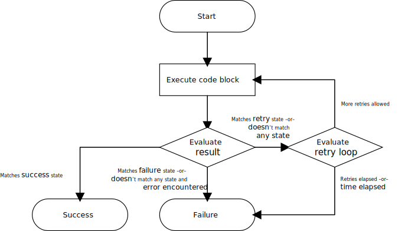

# Waiters design

* **Type**: Design
* **Author(s)**: Ian Botsford

## Abstract

This document describes the AWS SDK for Kotlin’s support for waiters, including implementation details and design
choices.

## Background

Waiters are a feature to facilitate polling AWS APIs. For instance, a caller may need to block while waiting for an S3
bucket to be created. Requiring callers to implement a polling loop themselves may incur boilerplate, errors, and
suboptimal timing.

Thus, waiters are implemented by SDK codegen. Waiters are
[modeled in Smithy](https://awslabs.github.io/smithy/1.0/spec/waiters.html) and annotated on various APIs by the service
teams. This provides a cohesive, reusable, succinct polling mechanism for callers.

Note that not every API supports waiters. Instead, waiters must be explicitly modeled for service operations (including
specific success/failure criteria).

## Terms

Most of these come from the Smithy specification for waiters but are reproduced here for context:

* **Acceptor**: A transition in a **waiter**’s finite state machine. An acceptor consists of a condition (defined by a
  **matcher**) and the state (success, failure, or retry) to which that condition should lead.
* **Matcher**: A test used to determine a **waiter**’s state. Matchers have the following subtypes:
    * **Success**: Matches based on whether the operation returned a successful (i.e., non-exception) response.
    * **ErrorType**: Matches based on whether the operation returned the given error type (by name).
    * **Output**: Matches based on the successful response of an operation, an operator, and an expected value.
    * **InputOutput**: Matches based on the input and successful response of an operation, an operator, and an expected
      value. Note that this type is not currently used by any AWS services.
* **Waiter**: A client-side abstraction used to poll a resource until a desired state is reached or a failure condition
  occurrs. Waiters are functionally finite state machines with transitions defined by **acceptors**.

## Generalized waiter workflow

In general, waiters execute a loop with two evaluation conditions and two exit states:



The block of code is always executed at least once and evaluated sequentially against each acceptor until:

1. If the result matches an acceptor with a **success** state, the workflow exits and yields the successful result.
2. If the result matches an acceptor with a **failure** state, the workflow exists and yields the failure result.
3. If the result matches an acceptor with a **retry** state, the retry loop itself is evaluated:
    1. If too many retries have occurred or too much time has elapsed, the workflow exits and yields a failure result.
    2. Otherwise, the code block is rerun and reevaluated.
4. If the result matched no acceptors:
    1. If the result was an error, the state is implicitly a **failure**. Thus, the workflow exists and yields the
       failure result (as in 2. above).
    2. Otherwise, the state is implicitly a **retry**. Thus, the retry loop itself is evaluated (as in 3. above).

## Examples

The following code samples model how waiters are intended to be used:

### Simple polling operation

This example shows a simple waiter polling until an S3 bucket exists:

```kotlin
val s3 = S3Client { ... }
s3.waitUntilBucketExists { // suspend call
    bucket = "my-bucket-that-may-not-exist-yet"
}
println("Succeeded")
```

### Overridden configuration

This example shows overriding the default waiter configuration:

```kotlin
val s3 = S3Client { ... }
val waiterConfig = WaiterConfig {
    maxTries = 10
    maxDuration = 5.minutes
}
val result = s3.waitUntilBucketExists(waiterConfig) { // suspend call
    bucket = "my-bucket-that-may-not-exist-yet"
}
...
```

## Invoking waiters

Waiters are provided as extension methods on the service client in a dedicated `waiters` subpackage. Waiter methods are
named after the waiter model name prepended with "waitUntil". For instance, a waiter in the S3 Smithy model called
`BucketExists` that operates on the `HeadBucket` operation would be generated as:

```kotlin
suspend fun S3Client.waitUntilBucketExists(
    config: WaiterConfig = WaiterConfig.Default,
    block: HeadBucketRequest.Builder.() -> Unit,
): WaiterOutcome<HeadBucketResponse> {
    ...
}
```

### Rejected alternatives

The following alternatives were considered but rejected:

* **Methods directly on the service client**. The original proposal in this design called for new methods directly on
  the service client (e.g., `S3Client`) rather than extension methods. This was rejected because of namespace pollution
  and the potential for confusion.
* **A dedicated waiter interface/class**. The Java v2 SDK makes waiters available through a `waiter()` method on service
  clients, which returns a dedicated object containing only methods for invoking waiters (e.g.,
  [`S3Waiter`](https://sdk.amazonaws.com/java/api/latest/software/amazon/awssdk/services/s3/waiters/S3Waiter.html)`).
  This adds an unnecessary layer of indirection for callers and the object itself maintains no useful state.

## Return type

The return type of a waiter call is a `WaiterOutcome` if the waiter succeeds:

```kotlin
sealed class WaiterOutcome<out T> {
    abstract val attempts: Int

    data class ResponseOutcome<out T>(
        override val attempts: Int,
        val response: T,
    ) : WaiterOutcome<T>()

    data class ExceptionOutcome(
        override val attempts: Int,
        val exception: Throwable,
    ) : WaiterOutcome<Nothing>()
}
```

The base class defines a field indicating the number of attempts in case callers want to know. There are two subtypes
indicating a non-exception or an exception result. Note that exception outcome may indicate a success for the waiter.

If the waiter fails, an exception is thrown. There are three cases where a waiter may fail:

* An API response matches an acceptor for a failed state
* The waiter exceeds the maximum number of attempts
* The waiter exceeds the maximum amount of time allowed

### Rejected alternatives

The following alternatives were considered but rejected:

* **Returning the last call’s response directly or throwing an exception**. This would not give callers enough
  information about whether the waiter had succeeded. For instance, S3’s `BucketNotExists` waiter *succeeds* on a
  `NotFound` exception. Throwing this exception to the caller as a result of the waiter invocation would require them to
  handle it and other non-success errors in their own code.
* **Using `Result<T>` directly as the return type**. Kotlin stdlib’s `Result<T>` is meant to model a response which
  could be either an exception or some strongly-typed result. Unfortunately, its notion of "success" and "failure" are
  directly tied to whether an exception was encountered. As noted in the bullet above, some waiters succeed on an
  exception and returning a `Result<T>` with an exception would give the caller no context that the waiter actually
  succeeded.
* **Returning an outcome for failures too**. Waiter failure could be modeled with an `WaiterOutcome` object with an
  `isSuccess` flag indicating whether the waiter succeeded. This will likely confuse callers, however. Methods named
  "waitUntil..." carry an implicit assumption that the waited-for condition will have occurred after the return. Callers
  may not bother to check an outcome object especially if they don’t need the result of a successful outcome.

## Implementation

The following details pertain to the implementation:

### Retry implementation

`StandardRetryStrategy` currently performs almost all the necessary functions except it is not input-aware and doesn't
return an `Outcome` (rather, returns the raw result). Because one type of matcher operates on both input and output
(e.g., to compare and output field to an input field), the `RetryStrategy` interface itself will need to be modified to
accept inputs and pass them along to retry policies.

Assuming that’s done, waiters could reuse `StandardRetryStrategy` with a no-op token bucket and an acceptor-iterating
retry policy:

```kotlin
class NoOpTokenBucket : RetryTokenBucket {
    override suspend fun acquireToken(): RetryToken = object : RetryToken {
        override suspend fun notifyFailure() = Unit
        override suspend fun notifySuccess() = Unit
        override suspend fun scheduleRetry(reason: RetryErrorType): RetryToken = this
    }
}

class AcceptorRetryPolicy<I, O>(val acceptors: List<Acceptor<I, O>>) : RetryPolicy<I, O> {
    override fun evaluate(input: I, result: Result<R>): RetryDirective =
        acceptors
            .firstNotNullOfOrNull { it.evaluate(input, result) }
            ?:
                if (result.isSuccess)
                    RetryDirective.RetryError(RetryErrorType.ServerSide)
                else
                    RetryDirective.TerminateAndFail
}
```

#### Rejected alternatives

The following alternatives were considered but rejected:

##### Implement new Waiter class

A new `Waiter` class with dedicated functionality can provide the waiting mechanism based on `StandardRetryStrategy`
but slimmed down to remove extraneous concerns (e.g., token bucket, retry reasons, etc.) and enhanced to address new
concerns (e.g., input is important to evaluating success, not just output):

```kotlin
enum class WaiterDirective {
    TerminateAndSucceed,
    TerminateAndFail,
    Retry,
}

class Waiter<I, O>(
    val options: WaiterOptions,
    val block: suspend (I) -> O,
    val acceptors: List<Acceptor<I, O>>,
    val delayProvider: DelayProvider,
) {
    suspend fun retry(input: I): WaiterOutcome<O> =
        withTimeout(options.maxDuration.inWholeMilliseconds) {
            doTryLoop(input, 1)
        }

    private tailrec suspend fun doTryLoop(
        input: I,
        attempt: Int,
    ): WaiterOutcome<O> {
        val callResult = runCatching { block(input) }
        when (val ex = callResult.exceptionOrNull()) {
            is CancellationException -> throw ex
        }

        val directive = acceptors
            .firstNotNullOfOrNull { it.evaluate(input, callResult) }
            ?:
                if (callResult.isSuccess)
                    WaiterDirective.Retry
                else
                    WaiterDirective.TerminateAndFail

        return when (directive) {
            WaiterDirective.TerminateAndSucceed -> return when (callResult.isSuccess) {
                true -> WaiterOutcome.ResponseOutcome<O>(attempt, callResult.getOrNull()!!)
                false -> WaiterOutcome.ExceptionOutcome(attempt, callResult.exceptionOrNull()!!)
            }

            WaiterDirective.TerminateAndFail ->
                throw WaiterFailedException("Waiter reached a failed state", callResult)

            WaiterDirective.Retry ->
                if (attempt >= options.maxAttempts) {
                    throw TooManyWaiterAttemptsException("Too many attempts, quitting", callResult)
                } else {
                    delayProvider.backoff(attempt)
                    doTryLoop(input, attempt + 1)
                }
        }
    }
}
```

This option was rejected because of too much code duplication and because `RetryStrategy` is already a relatively
reusable construct. It just needed to be enhanced from its (prior) definition to return an `Outcome` instead of the raw
result and to accept inputs in `RetryPolicy`.

### Acceptors

Acceptors can be modeled as an abstract class with subclassed matching logic:

```kotlin
abstract class Acceptor<in I, in O>(val state: RetryDirective) {
    abstract fun matches(request: I, result: Result<O>): Boolean

    fun evaluate(request: I, result: Result<O>): RetryDirective? =
        if (matches(request, result)) state else null
}
```

Implementations for **Success** and **ErrorType** matchers are straightforward and reusable:

```kotlin
class SuccessAcceptor(state: RetryDirective, val success: Boolean) : Acceptor<Any, Any>(state) {
    override fun matches(request: Any, result: Result<Any>): Boolean =
        result.isSuccess == success
}

class ErrorTypeAcceptor(state: RetryDirective, val errorType: KClass<*>) : Acceptor<Any, Any>(state) {
    override fun matches(request: Any, result: Result<Any>): Boolean =
        errorType.isInstance(result.exceptionOrNull())
}
```

Implementations for **Output** and **InputOutput** matchers need helper functions to be code-generated individually
based on the matcher path:

```kotlin
class OutputAcceptor<O>(state: RetryDirective, val matcher: (O) -> Boolean) : Acceptor<Any, O>(state) {
    override fun matches(request: Any, result: Result<O>): Boolean =
        result.getOrNull()?.run(matcher) ?: false
}

class InputOutputAcceptor<I, O>(
    state: RetryDirective,
    val matcher: (InputOutput<I, O>) -> Boolean,
) : Acceptor<I, O>(state) {
    data class InputOutput<I, O>(val input: I, val output: O)

    override fun matches(request: I, result: Result<O>): Boolean =
        result.getOrNull()?.let { matcher(InputOutput(request, it)) } ?: false
}
```

Here's an example of a code-generated output matcher based on a hypothetical Smithy model:

```javascript
// Smithy JSON snippet
{
    "state": "success",
    "matcher": {
        "output": {
            "path": "bar.baz",
            "expected": "qux",
            "comparator": "stringEquals"
        }
    }
}
```

```kotlin
// Code generated
val barBazQuxAcceptor = OutputAcceptor<Any, Foo>(RetryDirective.TerminateAndSucceed) {
    val bar = it?.bar
    val baz = bar?.baz
    baz.toString() == "qux"
}
```

### Path matchers

Both **Output** and **InputOutput** matcher types compare fields in generated shapes to expected values. For example,
MachineLearning’s `BatchPredictionAvailable` waiter contains the following matcher:

```javascript
{
    "matcher": {
        "output": {
            "path": "Results[].Status",
            "expected": "COMPLETED",
            "comparator": "allStringEquals"
        }
    }
}
```

This matcher examines the successful output of the API call (a `DescribeBatchPredictionsOutput` object), and collects
the `Status` field from every element in the output’s `Results` member, resulting in a string list. It then verifies
that every element in that string list is equal to `"COMPLETED"`.

These paths are specified as a [JMESPath](https://jmespath.org/) expression into the output (and possibly input) shapes.
Since the input and output shapes are known at codegen time, the path expression can be codegenned for the waiter
(rather than parsing the expression and inferencing at runtime). The following example shows how the above path
expression may be generated:

```kotlin
val matcher: (DescribeBatchPredictionsOutput) -> Boolean = {
    val results = it.results
    val resultsOrEmpty = results ?: listOf()
    val projection = resultsOrEmpty.flatMap {
        val status = it?.status
        listOfNotNull(status)
    }
    (projection?.size ?: 0) > 1 && projection?.all { it?.toString() == "COMPLETED" }
}
```

Smithy provides
[a JMESPath parser](https://github.com/awslabs/smithy/tree/main/smithy-jmespath/src/main/java/software/amazon/smithy/jmespath)
with visitor pattern that can be used for codegenning path-based matchers.

#### Rejected alternatives

The following alternatives were considered but rejected:

* **Runtime interpretation of path expressions**. JMESPath expressions follow a defined syntax and could be parsed at
  runtime by lexer/parser combination embedded in the SDK’s runtime. This offers no appreciable benefits over
  codegen-time path interpretation and offers the following downsides:
    * Discovery of invalid path expressions would be delayed until runtime.
    * Additional metadata (or reflection) would be required to assist a matcher in traversing shapes at runtime.
    * A full JMESPath parser would need to be included in the runtime.

# Appendix A: Waiter specification examples

Some design choices in this document were influenced by real-life waiter specifications in AWS services. This appendix
provides a collection of interesting waiter use cases directly from Smithy JSON models. Note that many extraneous parts
of the model are elided with `...` for brevity.

## Exception indicates success

S3’s `BucketNotExists` waiter only enters the success state when a `NotFound` exception is thrown:

```javascript
"com.amazonaws.s3#HeadBucket": {
    "traits": {
        "smithy.waiters#waitable": {
            "BucketNotExists": {
                "acceptors": [
                    {
                        "state": "success",
                        "matcher": {
                            "errorType": "NotFound"
                        }
                    }
                ],
                "minDelay": 5
            },
            ...
        },
        ...
    },
    ...
}
```

## Non-exception indicates failure

CodeDeploy’s `DeploymentSuccessful` waiter enters a failure state on non-exception outputs:

```javascript
"com.amazonaws.codedeploy#GetDeployment": {
    "traits": {
        "smithy.waiters#waitable": {
            "DeploymentSuccessful": {
                "acceptors": [
                    {
                        "state": "failure",
                        "matcher": {
                            "output": {
                                "path": "deploymentInfo.status",
                                "expected": "Failed",
                                "comparator": "stringEquals"
                            }
                        }
                    },
                    {
                        "state": "failure",
                        "matcher": {
                            "output": {
                                "path": "deploymentInfo.status",
                                "expected": "Stopped",
                                "comparator": "stringEquals"
                            }
                        }
                    },
                    ...
                ],
                "minDelay": 15
            }
        },
        ...
    },
    ...
}
```

## Complex JMESPath expression

Auto Scaling’s `GroupInService` waiter contains very complex JMESPath expressions:

```javascript
"com.amazonaws.autoscaling#DescribeAutoScalingGroups": {
    "traits": {
        "smithy.waiters#waitable": {
            "GroupInService": {
                "acceptors": [
                    {
                        "state": "success",
                        "matcher": {
                            "output": {
                                "path": "contains(AutoScalingGroups[].[length(Instances[?LifecycleState=='InService']) >= MinSize][], `false`)",
                                "expected": "false",
                                "comparator": "booleanEquals"
                            }
                        }
                    },
                    {
                        "state": "retry",
                        "matcher": {
                            "output": {
                                "path": "contains(AutoScalingGroups[].[length(Instances[?LifecycleState=='InService']) >= MinSize][], `false`)",
                                "expected": "true",
                                "comparator": "booleanEquals"
                            }
                        }
                    }
                ],
                "minDelay": 15
            },
            ...
        },
        ...
    },
    ...
}
```

## Waiter with multiple types of success criteria

CloudFormation’s `StackDeleteComplete` waiter succeeds on either a non-exception response indicating all stacks are in
the `"DELETE_COMPLETE"` state or on a `ValidationError`:

```javascript
"com.amazonaws.cloudformation#DescribeStacks": {
    "traits": {
        "smithy.waiters#waitable": {
            "StackDeleteComplete": {
                "documentation": "Wait until stack status is DELETE_COMPLETE.",
                "acceptors": [
                    {
                        "state": "success",
                        "matcher": {
                            "output": {
                                "path": "Stacks[].StackStatus",
                                "expected": "DELETE_COMPLETE",
                                "comparator": "allStringEquals"
                            }
                        }
                    },
                    {
                        "state": "success",
                        "matcher": {
                            "errorType": "ValidationError"
                        }
                    },
                    ...
                ],
                "minDelay": 30
            },
            ...
        },
        ...
    },
    ...
},
```

# Revision history

* 01/30/2022 – Created
